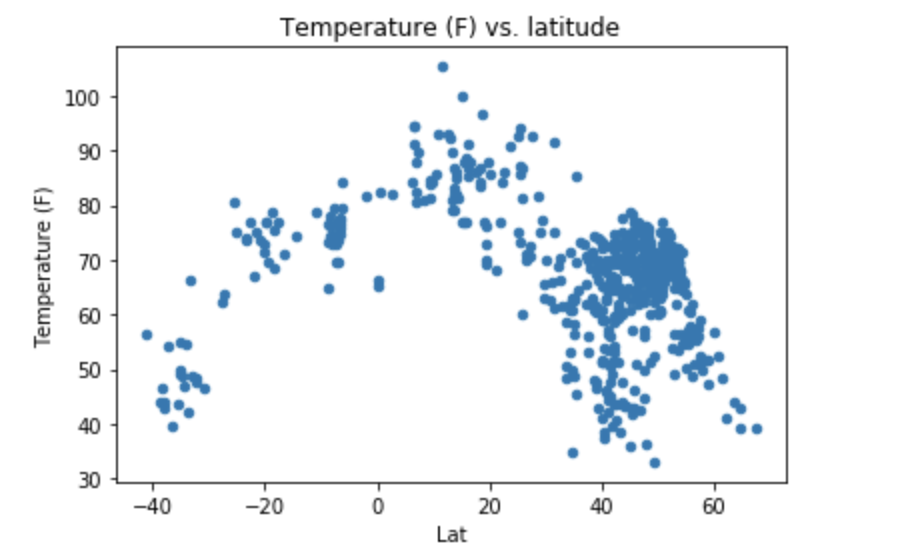
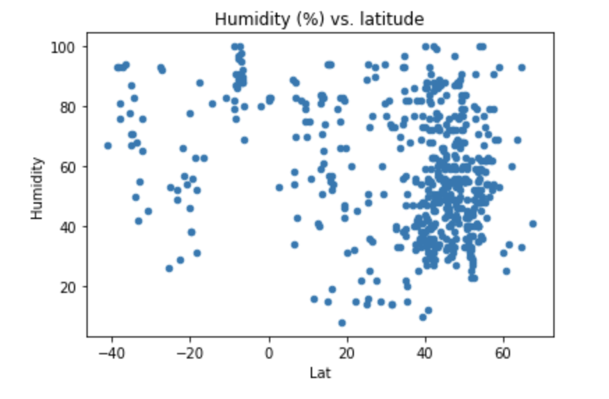
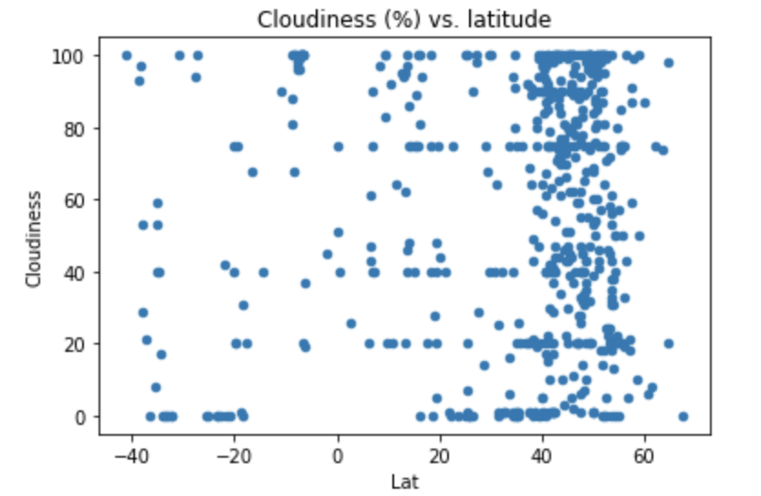
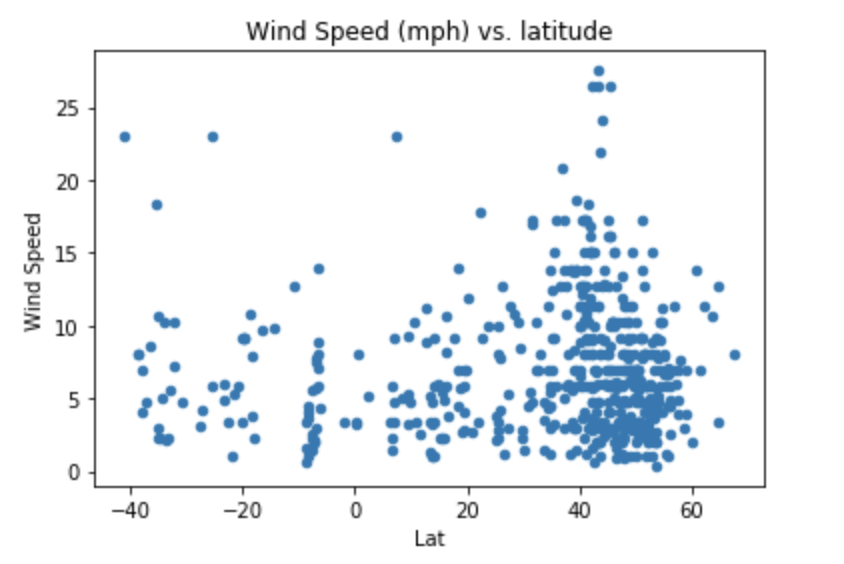
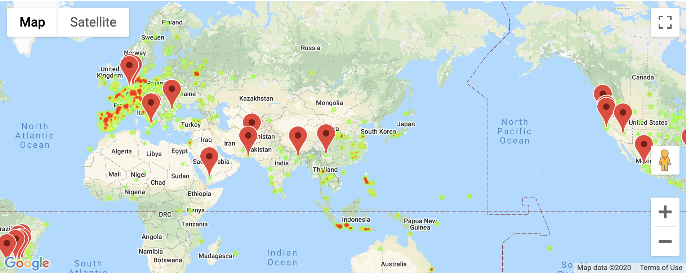

# python-api-challenge
Analyze whether data

## Overall
#### This project has two parts. First part `(WeatherPy)`,  randomly selected 600 cities from a given list of cities, and pull weather information from open weather API. Second part`(VacationPy)`, graph a heatmap based on the humidity of each areas, and select ideal cities based on your criterias, and pin on the heatmap. 

# Examples:
## Data Modeling and Plot Creation
  
  
  
  

## Google Maps
  
